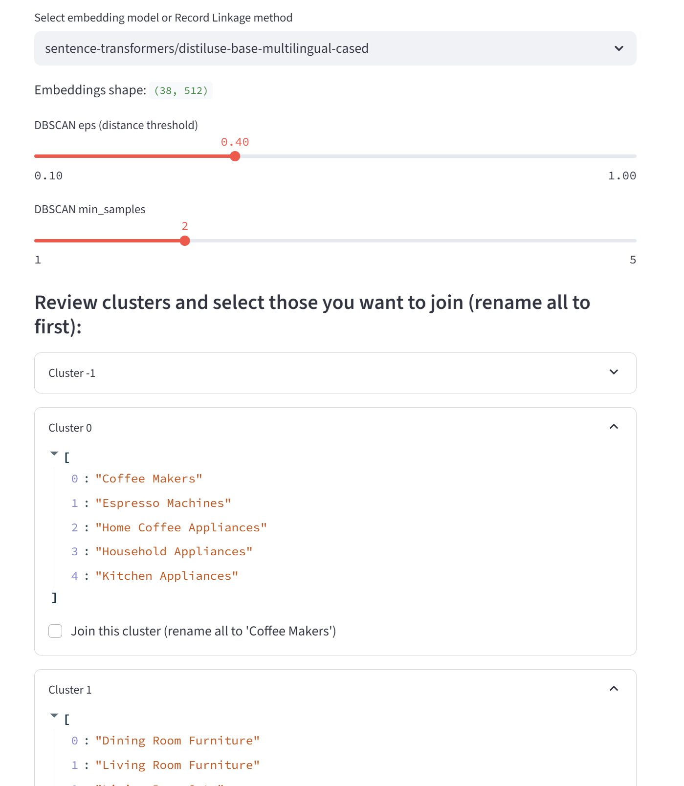

# Data Harmonizer

**Data Harmonizer** is an intelligent system for advanced product data processing, merging information from multiple sources into a unified, standardized format.
The application currently includes three core modules:

1. **Automatic Category Clustering** — merge categories using Sentence Transformers (DBSCAN on embeddings).
2. **Manual Merging** — users can manually join and fix clusters.
3. **Record Linkage** — flexible matching methods (RapidFuzz, Product Overlap, Hybrid).

---

**Planned modules:**

- **Attribute Harmonization:** unify and merge product attributes/properties from different sources into a single schema.
- **Unit Normalization:** convert all property values to a unified standard of measurement, so that attributes can be used as filters in e-commerce and product search.

---

This project is an interactive Streamlit web app for category similarity, clustering, and merging of product data from multiple sources. Both automatic (embedding-based) and manual (user-driven) merging are supported, with an iterative workflow.


## Features

- Upload multiple CSV files with product data from different sources
- Automatic category merging using Sentence Transformers (DBSCAN on embeddings)
- Manual cluster merging: select and fix groups as needed
- Iterative workflow: re-cluster and merge as many times as needed
- Support for manual methods (Record Linkage, RapidFuzz, Product Overlap, Hybrid)
- Preview intermediate and final tables before download
- Download the final grouped table with all original columns, including `source_file`
- Fast and user-friendly interface for large datasets


## How to Use

1. **Run the app:**
   ```
   streamlit run app.py
   ```
2. **Upload data:**
   - Upload your own CSV files or use the provided demo data.
   - Specify which columns correspond to product name, category, and SKU.
3. **Configure and cluster:**
   - Choose the merging method (embeddings or Record Linkage).
   - Adjust clustering parameters (eps, min_samples, similarity threshold, etc.).
   - Merge clusters manually and fix groups as needed.
   - Repeat steps as many times as necessary.
4. **Download results:**
   - Preview the final grouped table.
   - Download the resulting CSV file for further use.


## Requirements

- Python 3.8+
- See `requirements.txt` for dependencies:
  ```
  pip install -r requirements.txt
  ```


## Project Structure

- `app.py` — main Streamlit app code
- `requirements.txt` — Python dependencies
- `Upload/` — demo data and example source files
- `grouped_categories.csv` — resulting grouped file


## Example


*Upload files, configure parameters, merge categories, and download the result!*


## 🧪 Demo

You can try the Data Harmonizer prototype online:  
👉 [Open demo](https://data-harmonizer-hr9duerg436ujhogcljjuq.streamlit.app/)

---


## 🤝 Development Support

The prototype was developed and implemented with the support of the [**SDH.Global**](https://sdh.global) team — experts in DevOps, SaaS, and custom AI solutions.

If you want to turn this idea into a full-fledged commercial product, we recommend contacting **SDH.Global** for professional development and scaling assistance.


## License

MIT License